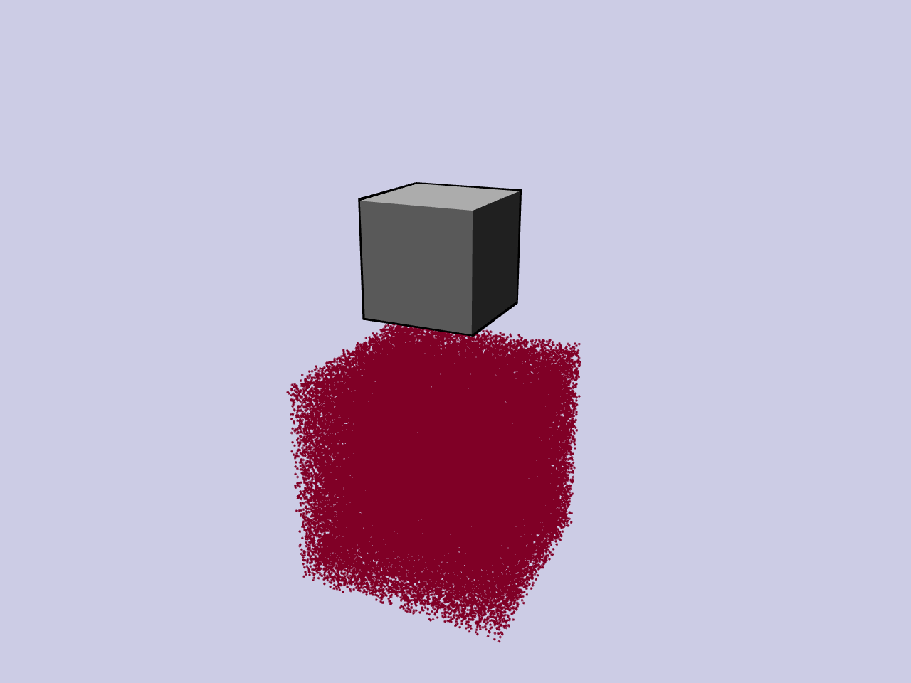

Quick Start Example with VSF Simulation
=======================================

Here we **show** a minimal example to visualize the simulation process of a
*point volumetric stiffness field* (Point VSF) model.

The example demonstrates how to:

* build a simple **Klampt** world containing a rigid cube,
* attach a force/torque sensor to that cube,
* create a uniformly-stiff PointVSF represented by randomly sampled points,
* run a quasi-static VSF simulator while moving the cube downward, and
* stream measurements while visualizing both the world and the sensed
  interaction forces.

Animated preview
----------------

Copy each section below into one file (e.g. ``minimal_vsf_quick_start.py``) **in
order**, then run it with ``python minimal_vsf_quick_start.py``.  Splitting the
code into thematic blocks makes it easier to follow and reuse.

Imports
~~~~~~~

.. code-block:: python
   :linenos:

   import numpy as np
   import time

   from klampt import vis
   from klampt.vis import Appearance
   from klampt.model import create
   from klampt.io import open3d_convert

   from vsf import PointVSF
   from vsf.sim.constructors import QuasistaticVSFSimulator
   from vsf.sim.klampt_world_wrapper import klamptWorldWrapper
   from vsf.visualize.klampt_visualization import vsf_to_point_cloud
   from vsf.sensor.force_torque_sensor import ForceTorqueSensor

   from vsf.visualize.o3d_visualization import create_vector_arrow

World and Sensor Setup
~~~~~~~~~~~~~~~~~~~~~~

.. code-block:: python
   :linenos:
   :lineno-start: 27

   # 1. Create a Klampt world and add a rigid cube
   world = klamptWorldWrapper()
   box = create.box(0.1, 0.1, 0.1, center=[0.0, 0.0, 0.2])
   world.add_geometry("cube", box, "rigid")
   world.setup_local_pcd_lst()
   world.setup_local_sdf_lst()

   # 2. Attach a force/torque sensor to the cube
   sensor = ForceTorqueSensor("force_torque_sensor", "cube")

VSF Creation and Simulator Initialization
~~~~~~~~~~~~~~~~~~~~~~~~~~~~~~~~~~~~~~~~~

.. code-block:: python
   :linenos:
   :lineno-start: 45

   # 3. Create a Point VSF: 100 k points in a 20 cm cube
   vsf = PointVSF(rest_points=np.random.rand(100_000, 3) * 0.2 - 0.1)
   vsf.stiffness += 1.0  # uniform stiffness

   # 4. Set up the quasi-static simulator
   simulator = QuasistaticVSFSimulator(world, [sensor])
   simulator.add_deformable("vsf", vsf)

Visualization Setup
~~~~~~~~~~~~~~~~~~~

.. code-block:: python
   :linenos:
   :lineno-start: 57

   # 5. Visualization
   vis.add("world", world.world, hideLabel=True)
   vis.add("vsf", vsf_to_point_cloud(vsf, auto_stiffness_threshold=0.0), hideLabel=True)
   vis.hideLabel("vsf")
   vis.show()

   input("Press <Enter> to start the simulation …")

Simulation Loop
~~~~~~~~~~~~~~~

.. code-block:: python
   :linenos:
   :lineno-start: 66

   # 6. Move the cube downward and visualize forces
   for z in np.linspace(0.0, -0.2, 120):

       vis.lock()

       # Rigid-body control: translation in z
       control = {
           "cube": np.array(
               [
                   [1.0, 0.0, 0.0, 0.0],
                   [0.0, 1.0, 0.0, 0.0],
                   [0.0, 0.0, 1.0, z],
                   [0.0, 0.0, 0.0, 1.0],
               ]
           )
       }

       simulator.step(control, 0.1)
       vis.unlock()

       measurements = simulator.measurements()
       print("force and torque:", repr(measurements["force_torque_sensor"]))

       time.sleep(0.1)

       # 7. Draw an arrow indicating the contact force
       center = np.array([0.0, 0.0, 0.2 + z])
       end = center + measurements["force_torque_sensor"][:3].numpy() * 5e-4

       if np.linalg.norm(end - center) > 0.01:
           arrow = create_vector_arrow(end, center, scale=5.0)

           arrow_appearance = Appearance()
           arrow_appearance.setColor(1.0, 0.0, 0.0, 0.5)
           arrow_appearance.setSilhouette(0)
           arrow_appearance.setCreaseAngle(0)

           vis.add(
               "arrow",
               open3d_convert.from_open3d(arrow),
               appearance=arrow_appearance,
               hideLabel=True,
               draw_order=-9999,
           )
           vis.hideLabel("arrow")